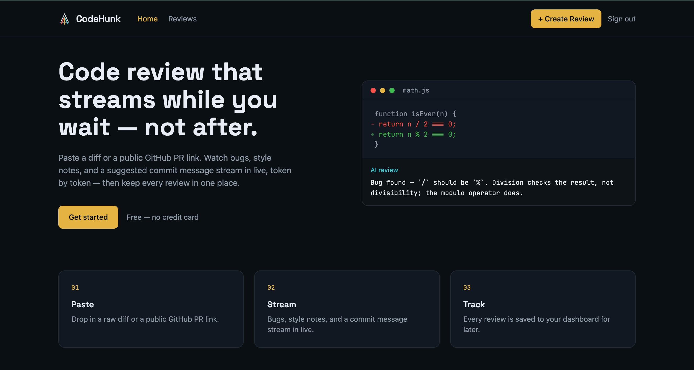
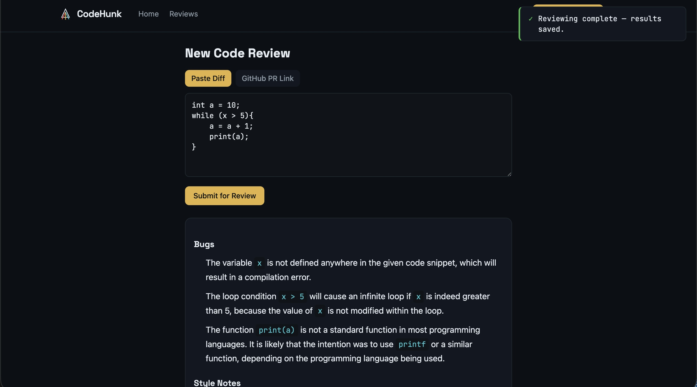
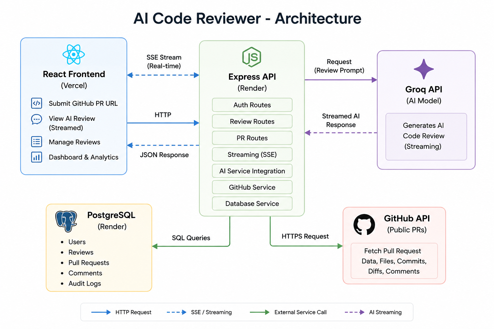

# CodeHunk - A GenAI Code Review SaaS Tool

AI-powered code review tool that streams bug and style feedback live as you review a diff or a GitHub pull request — built as a full-stack SaaS-style application with authentication, multi-user data isolation, and persistent review history.




<!-- Record a short screen capture of submitting a review and streaming in real time, then drop it at docs/demo.gif -->

---

## What it does

- Paste a raw code diff, or a public GitHub PR link
- Watch an AI-generated review stream in live, token by token — bugs, style notes, and a suggested commit message
- Every review is saved to your dashboard so you can revisit it later
- Multi-user, with server-side enforced data isolation (no user can access another user's reviews, even by guessing IDs)

---

## Tech stack

| Layer              | Choice                                          |
| ------------------ | ----------------------------------------------- |
| Frontend           | React (Vite) + Tailwind CSS v4                  |
| Backend            | Node.js + Express                               |
| Database           | PostgreSQL + Prisma ORM                         |
| Auth               | JWT                                             |
| LLM                | Groq (Llama 3.3 70B), streaming via SSE         |
| GitHub integration | GitHub REST API (public repos, unauthenticated) |
| Deployment         | Render (backend + Postgres) + Vercel (frontend) |

---

## Architecture



**Why SSE instead of WebSockets:** the streaming is one-directional (server → client), so SSE gives real-time delivery without the added complexity of a bidirectional connection this use case doesn't need.

---

## How a review works

1. User signs up / logs in → receives a JWT
2. User submits a raw diff or a GitHub PR URL
3. Backend verifies the JWT and extracts `userId` server-side (never trusted from the client)
4. If a PR URL was submitted, the backend fetches the real diff from GitHub's API
5. The diff is sent to Groq with a structured prompt (three sections: Bugs, Style Notes, Suggested Commit Message)
6. The response streams back token-by-token over SSE as it's generated
7. Once complete, the review is parsed into structured data and saved to Postgres
8. The review appears on the user's dashboard for later viewing

---

## Security

- **JWT-based auth** — every protected route verifies a signed token before proceeding
- **IDOR protection** — every review query filters by `userId` extracted from the verified JWT, never from a client-supplied ID. Requesting another user's review by ID returns an identical 404, whether it doesn't exist or belongs to someone else
- Passwords hashed with bcrypt, never stored in plain text

---

## Project structure

```
genai-code-reviewer/
├── backend/
│   ├── src/
│   │   ├── routes/          # auth.js, review.js
│   │   ├── controllers/     # authController.js, reviewController.js
│   │   ├── services/        # llmStreamService.js, githubService.js, reviewParser.js
│   │   ├── middleware/      # authMiddleware.js
│   │   └── app.js
│   ├── prisma/
│   │   └── schema.prisma
│   └── package.json
├── frontend/
│   ├── src/
│   │   ├── pages/           # Landing.jsx, AuthPage.jsx, Dashboard.jsx, ReviewDetail.jsx
│   │   ├── components/      # Navbar.jsx, Toast.jsx, StreamingOutput.jsx, ReviewCard.jsx, IssueList.jsx
│   │   ├── api/
│   │   │   └── client.js
│   │   └── App.jsx
│   └── package.json
└── README.md
```

---

---

## Running locally

### Prerequisites

- Node.js 20.19+
- A Groq API key (free at [console.groq.com](https://console.groq.com))

### 1. Clone and install

```bash
git clone https://github.com/nethuli-dev/genai-code-reviewer.git
cd genai-code-reviewer

cd backend && npm install
cd ../frontend && npm install
```

### 2. Set up the database

```bash
cd backend
npx prisma dev
```

Leave this running — it starts a local Postgres instance and prints connection strings.

### 3. Configure environment variables

Create `backend/.env`:

```env
DATABASE_URL="<paste from npx prisma dev output>"
SHADOW_DATABASE_URL="<paste from npx prisma dev output>"
JWT_SECRET="your-dev-secret"
GROQ_API_KEY="your-groq-api-key"
PORT=3001
FRONTEND_URL="http://localhost:5173"
```

Create `frontend/.env`:

```env
VITE_API_BASE=http://localhost:3001
```

### 4. Run migrations

```bash
cd backend
npx prisma migrate dev
```

### 5. Start both servers

In separate terminals:

```bash
# Terminal 1 — backend
cd backend && npm run dev

# Terminal 2 — frontend
cd frontend && npm run dev
```

Open the URL Vite prints (usually `http://localhost:5173`).

---

## Known limitations

- **GitHub API rate limits** — unauthenticated requests are capped at 60/hour. Fine for demo use; would need OAuth for production scale.
- **Large diffs** — very large PRs may exceed the LLM's context window. Not currently chunked; a known v1 limitation.
- **Public repos only** — private repo/PR support would require GitHub OAuth, intentionally out of scope for v1.
- **Render free tier** — the backend sleeps after 15 minutes of inactivity (30-60s cold start on next request), and the free Postgres instance expires after 90 days.

---

## Future improvements

- Diff chunking for large PRs
- GitHub OAuth for private repos + inline PR comments
- Retry handling for failed LLM requests
- Per-user rate limiting
- Review severity scoring

---

## Author

**Nethulina Tharadhanapala**

---

## License

MIT
